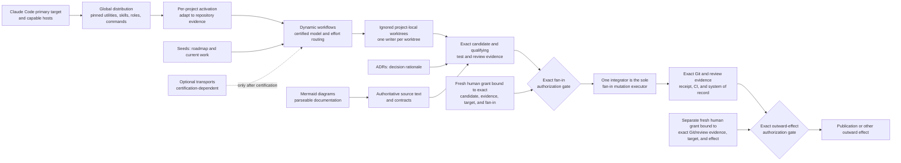

# Agentic SDLC vision

Agentic SDLC is a portable, host-installed software-delivery control system. Claude Code is the primary target; other capable hosts participate through shared contracts rather than host-specific doctrine. It is intended to make disciplined delivery repeatable without treating automation as authority.

## Distribution and activation

Mise is the only bootstrap prerequisite. A global installation is meant to distribute pinned helper utilities, skills, role agents, commands, validators, and lifecycle tooling. It does not make a repository ready by itself. Per-project activation must inspect and safely adapt to the repository's existing policy, ownership, baseline, and capabilities instead of spraying generic scaffolding or overwriting local work.

## Evidence-led delivery

Substantive workflows decompose work at runtime. Each phase should use the certified model, effort, and context shape appropriate to its decision and verification burden, with identity and routing read back rather than inferred. Independent work may scale dynamically into parallel agents only within one top-level mission envelope: nested workflows cannot declare new roots. Budgets are debited across all descendants, concurrency/WIP slots are reserved and released within the same shared cap, and delegation depth is measured from that top-level root. Evidence must warrant the work, and every parallel writer receives its own project-local ignored worktree. Reviews advise; they do not authorize. Exact candidate/evidence and a separate fresh human grant must structurally meet before the sole integrator may mutate Git.

Seeds records the roadmap, milestones, epics, phases, dependencies, and current work; it is not an authorization channel. ADRs preserve the rationale for architectural decisions as evidence evolves; authoritative source text and contracts define the current requirements and interfaces. Mermaid diagrams make technical documentation intuitive and parseable for people and agents, while their readable source text remains authoritative. Git is the system of record and evidence authority, not effect authority. Each grant is current, single-use, and bound to the exact candidate, evidence, target, and authorized effect; any change to the queue, candidate, target, or evidence invalidates it. After fan-in, publication or any other outward effect requires its own gate where exact Git/review evidence and a separate fresh human grant meet.

Optional transports, including CLIProxyAPI and claude-code-proxy, remain aspirational until certified for exact model and effort routing, identity readback, credential safety, and recovery. A configuration or a local success is not certification.

## Self-hosting, learning, and authority

Agentic SDLC is self-hosting: it improves this repository through the same contracts it installs in downstream projects. That recursion is a conformance test, not elevated self-modification authority. The system should learn from verified outcomes and evolve its skills, policies, and plans, while preserving uncertainty and the evidence behind changes.

It must never grant itself permission, bypass gates, overwrite foreign or user data, merge its own work, or hide uncertainty. A conductor may disposition internal queues and proposals within the authorized scope, but cannot add, substitute, or broaden work after authorization; changed scope returns for a new human grant. Only the integrator executes authorized fan-in, and that ownership creates no authority to publish, merge, deploy, or mutate external systems.

## Success criteria

The vision succeeds when a capable host can install the portable control system, activate it safely in a real repository, and produce isolated, evidence-backed candidates through phase-aware routing. Its records and diagrams must explain both current work and architectural decisions; its gates and Git receipts must make outcomes independently checkable. Its behavior on this repository and downstream projects must demonstrate the same boundaries: learning improves future work without weakening human authority, data ownership, or delivery controls.
